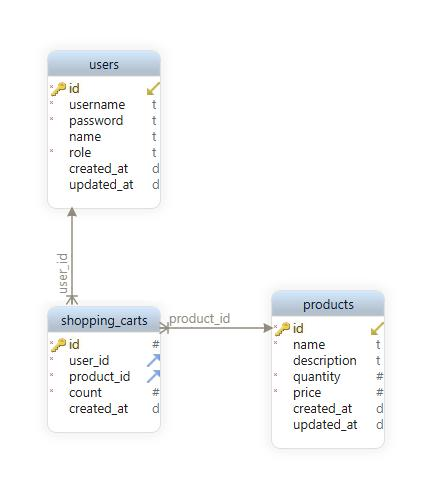

# NestJS Online store CRUD

## Introduction

This is a simple CRUD example written in `nodejs` and `typescript` and makes use of `nestjs framework`.

We have 4 modules:

- Auth
- User
- Product
- Shopping-cart

each user can do a complete CRUD. also, users can add or remove products in their shopping-cart.

in the `Auth` module users can register or login. it makes use of JWT.

## API docs

you can use swagger or postman collection.

- postman: [postman_collection.json](./docs/postman/Online%20store%20(NestJS%20CRUD).postman_collection.json)
- swagger: `/docs`

## Installation

this project can be run with docker:

first, you MUST set all your environment variables in `.env` file. please create this file based on `.env.example`
file and fill all variables.

then, you can run this command (make sure docker and docker-compose are up and running on your machine):

```bash
docker-compose up --build
```

or you can simply install packages and run project:

```bash
yarn install

# for production
yarn build
yarn start:prod 

# for development
yarn start:dev
```

## Structure

```
└───app
    ├───docs
    │   ├───db
    │   ├───db-schema
    │   └───postman
    ├───logs
    ├───src
    │   ├───lib
    │   ├───modules
    │   │   └───MODULE_NAME
    │   │       ├───controllers
    │   │       ├───dto
    │   │       ├───entities
    │   └───────└───services
    └───tests
```

#### docs:

this folder contains postman documents for API collections. it also contains schema file of project database.

#### logs:

this folder contains logs that are generated by the winston logger. (this folder will be created after running project)

#### src:

this folder contains the source code of the app (in typescript).

#### src/lib:

this folder contains all common entities and reusable components that we need in project. like configs, global
exception-filters, pipes, etc.

#### src/modules:

this folder contains modules of our app. each module is a separated domain of our application.

## Database schema



[db_schema_v1.dbs](./docs/db-schema/db_schema_v1.dbs)

## Packages information

This project is built with `Nodejs (16.14.0)` and `TypeScript (4.3.5)`. most important used packages are:

| Use case      | Package                                                   |
|---------------|-----------------------------------------------------------|
| Web framework | [`NestJS (^9.0.0)`](https://docs.nestjs.com/)             |
| Database      | [`postgres (13.3-alpine)`](https://www.postgresql.org/)   |
| Logging       | [`winston (3.6.0)`](https://github.com/winstonjs/winston) |

## To improve

some improvements can be done to this app:

- [ ] Add Role system. only `admin` role can create users and products.
- [ ] add pagination to APIs instead of fetch all data.
- [ ] add `migrations` and `seeders`.
- [ ] add unit tests.
- [ ] add feature tests.
- [ ] add more features to project (like category for products).
- [ ] add payment module and decrease quantity of products after payment.
- [ ] add `refresh_token` strategy for `auth` module.
